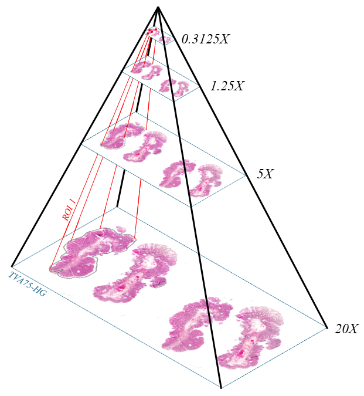
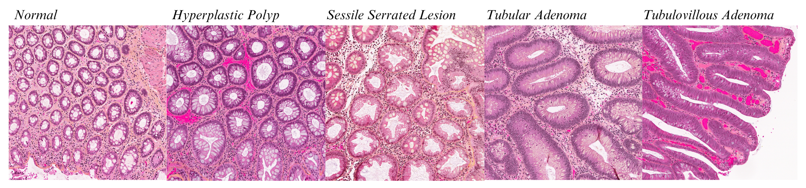
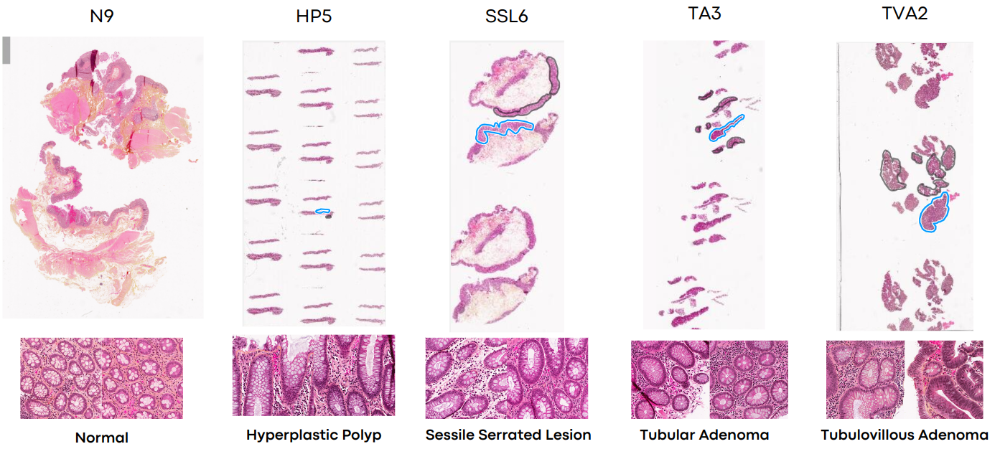
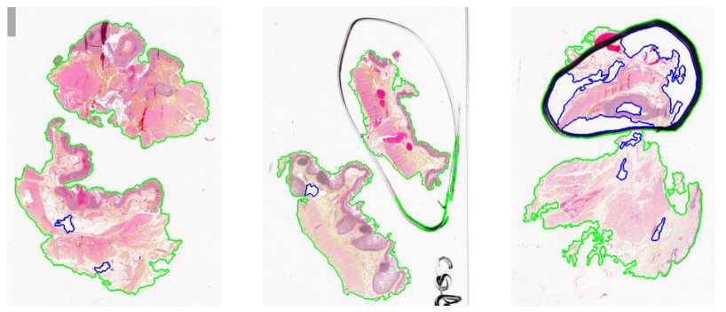
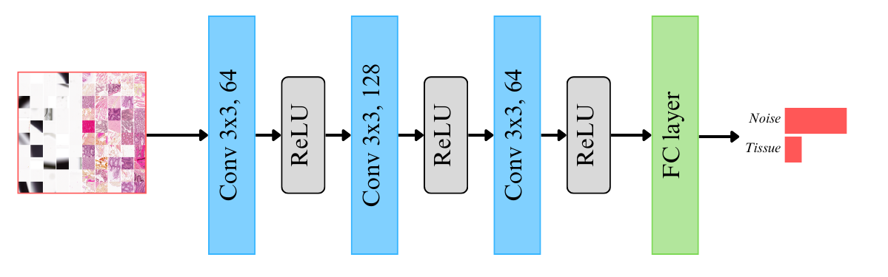

# PatchKGH (pKGH)
:recycle:*Garbage in, garbage out* - classic saying for data curation in Computer Vision  
The KGH dataset is a private dataset for colorectal polyps classification, consisting of **1037 Whole Slide Images** (WSIs) encompassing both healthy colon tissue and colon polyps. The pathological WSIs have been annotated at the region of interest (ROI) level. In order to train deep learning models for colorectal polyp classification applied to this dataset, we need to extrat patches from the WSIs. To achieve a good representation of this dataset, we need to perform strong data curation and extract patches, or tiles, which are cleaned and do not present with any artefacts.
## :open_file_folder: Presentation of the dataset and its annotations
KGH dataset is a private dataset of colorectal polyps. The WSIs come with 4 resolution levels: 20X, 5X, 1.25X and 0.3125X. The figure below shows the different downsampled levels as well as a ROI annotation. The resolution at 20X is of 0.4 mpp (microns per pixels). The tissue thickness in these slides is of 5 microns.  
<div align="center">
  
</div>
The polyps studied in this dataset are Sessile Serrated Lesions (SSL), Hyperplastic Polyps (HP), Tubulovillous Adenoma (TVA) and Tubular Adenoma (TA). This dataset is also presenting normal, or histological, colon tissues. One WSI can present multiple ROIs. 

### Studied colorectal polyps
Four different types of colorectal polyps are studied in this dataset:
- **Sessile Serrated Lesions (SSL)**: SSLs, a subtype of serrated polyps, constitute at least 20% of all serrated polyps. They are considered precancerous and are characterized by a flat or slightly elevated shape, predominantly found in the cecum and ascending colon. Distinguishing SSLs from hyperplastic polyps may pose challenges, although certain distortions can be recognized by pathologists;
- **Hyperplastic Polyps (HP)**: These noncancerous growths carry a low risk of malignant transformation and are characterized by an overgrowth of normal cells in the mucosal lining of the colon or distal colon;
- **Tubular Adenoma (TA)**: These are usually small and benign polyps, prevalent in more than 80% of cases. While they are considered precancerous, less than 10% of them have the potential to progress into cancer;
-  **Tubulovillous Adenomas (TVA)**: TVAs are a subtype of colonic adenomas exhibiting a combination of tubular and villous features. Considered precancerous, they have the potential to transform into malignant structures. 
The figure below highlights the four different polyps and a normal patch, under a Field of View (FoV) of 800x800 microns
<div align="center">
  
</div>

### Regions of interest (ROI) annotations
A pathologist annotated some regions of interest in the slide. It is important to highlight that regions outside ROIs cannot be considered as normal tissue regions nor as pathological regions. They contain normal tissue, distorted tissue and pathological tissue which have not been annotated. The figure below shows 5 WSIs from the 5 different classes with ROI annotations and patches extracted from a ROI when applicable.
<div align="center">
  
</div>

## :mega: Use the dataset in your own framework
The dataset needs to be stored such as: 
``` console
root/
├── train/
│ ├── Normal/
│ │ ├── NX-id-coords.png
│ │ └── NX-id-coords.jpg
| ├── CP_HP/
│ │ │ ├── ROI
| | │ │ ├── HPX-id-roi_id-coords.png
│ | | │ └── HPX-id-roi_id-coords.jpg
│ │ | ├── nonROI
| | │ │ ├── HPX-id-coords.png
│ | | │ └── HPX-id-coords.jpg
│ ├── ...
├── test/
│ ├── Normal/
│ │ ├── NX-id-coords.png
│ │ └── NX-id-coords.jpg
| ├── CP_HP/
│ │ │ ├── ROI
| | │ │ ├── HPX-id-roi_id-coords.png
│ | | │ └── HPX-id-roi_id-coords.jpg
│ │ | ├── nonROI
| | │ │ ├── HPX-id-coords.png
│ | | │ └── HPX-id-coords.jpg
│ ├── ...
```
You can then call [pkgh class](pkgh.py)
```
dataset = pkgh(root_dir, split = 'train', ROI = False, balance = False, transform = transform)
```
if you want to use all images from ROI and nonROI, from the train set
## :person_fencing: Patch extraction challenges
When having a closer look at our dataset (Figure below) , we remark than some slides have been annotated with a marker and contains either contours or handwritten annotations. 
<div align="center">
  
</div>

*The daset presents marker annotations*  
The application of two state-of-the-art methods revealed limitations in our dataset. The handwritten annotations and inherent slide noise presented challenges for the various segmentation strategies employed. To address these issues, we developed a novel data processing approach specifically designed to mitigate the impact of noisy patches. The custom CNN to detect noisy patches is made of 3 convolutional layers followed by ReLU activation functions. It was trained for 20 epochs on a dataset of 8686 samples made of noisy patches (4475) and tissue patches (4211) extracted at different Fields of view
<div align="center">
  
</div>

*Custom CNN*
## :mag: Patch extraction code
You will find the code for patch extraction in this [folder](patch-extraction).  
To run an extraction, you can precise `--datafolder` where the WSIs are stored, the Field of View (`--fov`) of extraction, the level of extraction (`--level` between 0 and 2), the output folder for your new dataset (`--output`) and the `--size` under which the patches will be saved:
```shell
python3 extraction_huron.py --size 256 --fov 800 --level 1 --method overlap --output ./kgh_800
```
A basic `--threshold 50` for patch/ROI overlap is fixed `--method overlap` is chosen (default). By default, the background and noisy patches are not saved, you can activate the saving using `--save True` and these patches will be saved in specific background folders.  
A [script](patch-extraction/extraction_script_example.sh) is given as an example.
## :computer: Conda environment for patch extraction
To work in the environment supporting [TIAToolBox](https://github.com/TissueImageAnalytics/tiatoolbox) and PyTorch (2.2.1), you can download the conda configuration file and follow the instructions below:
```shell
conda env create -f env.yml
```
Activate the environment:
```shell
conda activate tia-env
```
## :mailbox_with_mail: Contact information
For any questions, you can create an issue or send your question at [my courriel adress](mailto:cassandre.notton@mail.concordia.ca)
