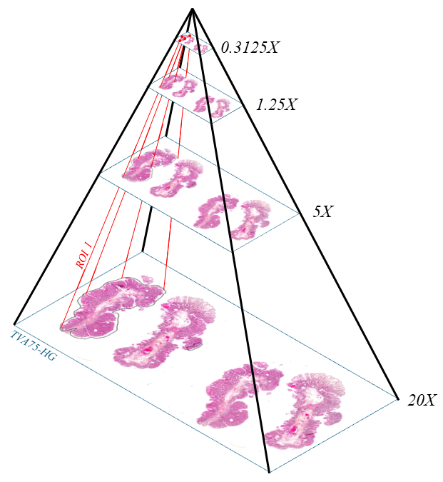
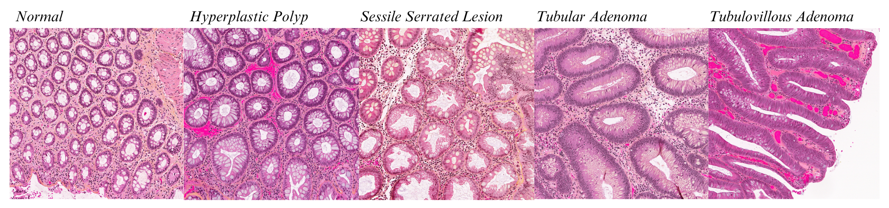

# PatchKGH (pKGH)
:recycle:*Garbage in, garbage out* - classic saying for data curation in Computer Vision  
The KinGston General (KGH) dataset for colorectal polyps classification consists of **1037 Whole Slide Images** (WSIs) encompassing both healthy colon tissue and colon polyps. The pathological WSIs have been annotated at the region of interest (ROI) level by Dr. Sonal Varma using a software developed by Huron Digital Pathology. In order to train deep learning models for colorectal polyp classification applied to this dataset, we need to extrat patches from the WSIs. To achieve a good representation of this dataset, we need to perform strong data curation and extract patches, or tiles, which are cleaned and do not present with any artefacts.
## :open_file_folder: Presentation of the dataset and its annotations
KGH dataset requires 1.2 TB of storage. All slides are stored as .tif files presenting with 4 resolution levels: 20X, 5X, 1.25X and 0.3125X. The figure below shows the different downsampled levels as well as a ROI annotation. The resolution at 20X is of 0.4 mpp (microns per pixels). The tissue thickness in these slides is of 5 microns.  
<div align="center">
  
</div>
The polyps studied in this dataset are Sessile Serrated Lesions (SSL), Hyperplastic Polyps (HP), Tubulovillous Adenoma (TVA) and Tubular Adenoma (TA). This dataset is also presenting normal, or histological, colon tissues. One WSI can present multiple ROIs. The number of WSIs and annotations per class is given in the table below:

| Class  | Number of WSIs | Number of ROIs |
| ------------- | ------------- | ------------- |
| Normal (histology)  | 200  | 0  |
| Hyperplastic Polyps (HP) | 212 | 284 |
| Sessile Serrated Lesions (SSL) | 201 | 548 |
| Tubular Adenoma (TA) | 207 | 465 |
| Tubulovillous Adenoma (TVA) | 217 | 842 |

### Studied colorectal polyps
Four different types of colorectal polyps are studied in this dataset:
- **Sessile Serrated Lesions (SSL)**: SSLs, a subtype of serrated polyps, constitute at least 20% of all serrated polyps. They are considered precancerous and are characterized by a flat or slightly elevated shape, predominantly found in the cecum and ascending colon. Distinguishing SSLs from hyperplastic polyps may pose challenges, although certain distortions can be recognized by pathologists;
- **Hyperplastic Polyps (HP)**: These noncancerous growths carry a low risk of malignant transformation and are characterized by an overgrowth of normal cells in the mucosal lining of the colon or distal colon;
- **Tubular Adenoma (TA)**: These are usually small and benign polyps, prevalent in more than 80% of cases. While they are considered precancerous, less than 10% of them have the potential to progress into cancer;
-  **Tubulovillous Adenomas (TVA)**: TVAs are a subtype of colonic adenomas exhibiting a combination of tubular and villous features. Considered precancerous, they have the potential to transform into malignant structures. 
The figure below highlights the four different polyps and a normal patch, under a Field of View (FoV) of 800x800 microns
<div align="center">
  
</div>

## :person_fencing: Patch extraction challenges
## :mag: Patch extraction code
## :computer: Conda environment for patch extraction
To work in the environment supporting [TIAToolBox](https://github.com/TissueImageAnalytics/tiatoolbox) and PyTorch (2.2.1), you can download the conda configuration file and follow the instructions below:
```shell
conda env create -f env.yml
```
Activate the environment:
```shell
conda activate tia-env
```
## :mailbox_with_mail: Contact information
For any questions, you can create an issue or send your question at [my courriel adress](mailto:cassandre.notton@mail.concordia.ca)
